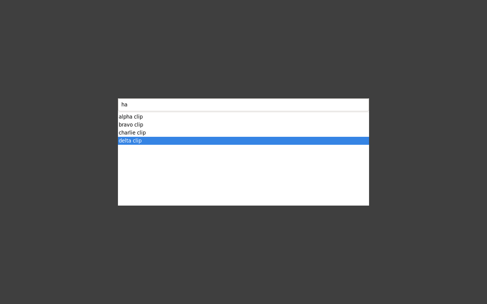
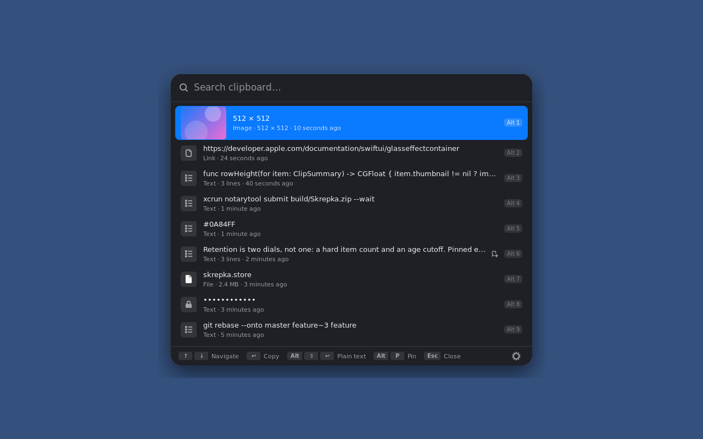

# Phase 7 — The Linux GUI

**Two to three weeks, and the widest error bars on the roadmap. If a phase
slips, it is this one.**

## Goal

Hotkey → picker → select → pasted, on KDE and on Sway, with a working tray icon.

## Preconditions

- Phase 6 done and the daemon useful on its own. That is what makes this phase
  optional rather than load-bearing, and it is worth having that safety net
  before starting the most uncertain work on the list.
- [D-4](open-questions.md#d-4)'s three-day budget and stop rule remain in force,
  but its toolkit outcome and exit status are provisional pending the required
  Steam Deck/KDE validation: **if both toolkits fail, the project stops at
  Phase 6.** Not Qt, not XWayland-only. Step 1 below is how the decision gets
  made with code rather than on paper; its current raw GTK4 direction is not a
  final toolkit selection.
  **Amended 2026-09-18:** that validation is deferred with all Linux hardware
  testing, by the owner's decision. Work continues on the raw GTK4 direction
  against the headless Sway, and `skrepka-palette-demo` plus section 4 of
  [`steam-deck-session.md`](steam-deck-session.md) are the KDE check, ready to
  run. Until it runs, every step built on GTK4 carries the risk that KWin
  disagrees.
- [OQ-12](open-questions.md#oq-12) answered, because the mark has to render.
- **A KDE session to build against: the Steam Deck, in Desktop Mode**
  ([D-10](open-questions.md#d-10)). It supplies `xdg-desktop-portal-kde` for the
  global shortcut and a native StatusNotifierItem host for the tray, which are
  steps 3 and 4 below. **Sway still needs a second machine or a VM.** Game Mode
  is out of scope — this phase builds a desktop picker and nothing else.
- Note the screen it has to look right on: **1280×800 at 90 Hz**. The macOS
  picker's metrics were drawn for a laptop display, and a palette that is
  perfectly proportioned on a Mac can cover half of that one. Check early — it
  is a layout decision, and layout decisions get expensive after the widgets
  exist.

## The honest starting position

Design §5 ranks the Swift GUI options bluntly and no option scores better than
"alive but thin":

1. **`stackotter/swift-cross-ui`** — alive, GTK backend. No tray icon and no
   floating-palette window role, both of which Skrepka needs.
2. **`rhx/SwiftGtk`** — raw GTK4 bindings, alive but thin.
3. **`AparokshaUI/adwaita-swift` — archived 2024-10-17.** Verified via the
   GitHub API. Not a candidate.
4. Qt through C++ interop — possible, no prior art for a Swift app.

Re-verify all four before starting. The ranking is dated 2026-09-04 and the top
two are small projects, where a year is the difference between thriving and
abandoned.

> **Re-verified 2026-09-08, and one entry above is wrong.** `adwaita-swift` is
> not abandoned: it *moved*, to `https://codeberg.org/aparoksha/adwaita-swift`,
> and the GitHub repository is archived because of the move. Its last commit was
> four days before this was written. Anything reading the table above should
> read [the outcome](#the-outcome-of-step-1) instead, which is written against
> what all four are today.

## Deliverables

```
Sources/SkrepkaLinuxUI/
  Picker/{PickerWindow,PickerList,PickerRow,SearchEntry}.swift
  Tray/StatusNotifierItem.swift
  Hotkey/GlobalShortcutsPortal.swift
  Settings/{SettingsWindow,RetentionPane,ExclusionsPane,PeersPane}.swift
  Thumbnails/GdkPixbufThumbnailMaker.swift    # ThumbnailProducing conformance
Sources/SkrepkaCore/Branding/
  MarkPath.swift                # portable path IR, if OQ-12 says so
prototypes/                     # step 1, kept or deleted deliberately
```

The `Picker/` names above were the plan; see "What has landed" below for what
actually shipped — `PaletteWindow.swift` rather than `PickerWindow.swift`, with
the key map and metrics split into their own tested files. The rows have since
landed as `PickerListView`, `PickerRowView` and `PickerSearchBar`, and the tray
and the shortcut as `Tray/TrayIcon.swift` and `Hotkey/GlobalShortcuts.swift`;
the 2026-09-21 section lists what shipped.

### What has landed, 2026-09-08

Step 1 of the "Work" list has a Sway prototype; its toolkit direction and
D-4 status remain provisional pending the required Steam Deck/KDE validation.
Step 2 has its foundation and not its rows; the portable branding work is
preparatory for step 4; thumbnails (step 6) remain unstarted; steps 3, 4 and 5
are otherwise untouched.

```
Sources/CGtk4/{shim.h,module.modulemap}          GTK4 + gtk4-layer-shell, one module
Sources/SkrepkaLinuxUI/
  Backend/GtkSession.swift                       gtk_init, the main loop, layer-shell probe
  Picker/PaletteWindow.swift                     the overlay: layer-shell, keys, list, search
  Picker/PaletteWindow+Signals.swift             GTK signal handlers, split out of the window
  Picker/PickerCommand.swift                     the key map, tested
  Picker/Keysym.swift                            X11 keysyms and GDK modifier bits
  Picker/PaletteMetrics.swift                    sizing, and the 1280×800 fit, tested
Sources/SkrepkaCore/Picker/PasteStyle.swift      moved here from the app target
Sources/SkrepkaCore/Branding/MarkPath.swift      the portable path IR — OQ-12
Sources/SkrepkaCore/Branding/PaperclipMark.swift the coordinate table, platform-free
Tests/SkrepkaLinuxUITests/                       key map and metrics
prototypes/palette-bakeoff/                      step 1, kept — see its README
docker/Dockerfile.linux                          + GTK4, gtk4-layer-shell, wtype, grim
```



That is `SkrepkaLinuxUI` itself, not the prototype: a throwaway driver linked
the real `PaletteWindow`, ran it under the same headless sway, and drove it with
real key events. Down moved the selection, Page Down jumped five and clamped,
typing reached the search field, and Return came back as
`choose(.rich)` — so the target is *run*, not merely compiled. The window sized
itself to 660 × 282 for four rows rather than to the 540 cap, which is
`PaletteMetrics` working.

One harness limit worth knowing before the next person debugs it: `wtype`
uploads a fresh virtual keymap per invocation, and sway needs a moment to apply
it, so **back-to-back `wtype` calls are dropped** — reliably, and in both the
prototype and the real target. Three seconds between key presses is enough. A
dropped key there is the harness, not the picker.

### What has landed, 2026-09-18: Settings, the devices half

Step 5's pairing and paired-devices part, ahead of the Steam Deck session so
the session can exercise it. (`skrepka-settings` has since been folded into
`skrepka-gui` — see 2026-09-21 below.) It is an ordinary window, not a
layer-shell surface, and it is the macOS Sync pane in GTK4: this device's name
and code, the "Allow new devices to pair" switch, every paired and sighted
device with Pair… / Unpair, a per-device Live clipboard switch, Sync Now, and
the code-comparison dialog for both directions. Retention and exclusions are
not in it — the daemon's interface cannot set them yet.

```
Sources/SkrepkaLinuxUI/Backend/MainLoopInbox.swift   Sendable values onto GTK's loop: Mutex + eventfd
Sources/SkrepkaLinuxUI/Backend/MainLoopWatch.swift   the loop-thread end, a g_unix_fd source
Sources/SkrepkaLinuxUI/Settings/                     the window; SyncModel and the *State types are
                                                     the pure, tested half; DaemonLink the bus half
Sources/skrepka-settings/main.swift                  the executable, dev.soldunov.Skrepka.Settings
packaging/desktop/dev.soldunov.Skrepka.Settings.desktop
```

Three things it settled that the picker's daemon connection will reuse:

- **How an async answer reaches a GTK widget.** `DaemonProxy` answers on
  Swift's concurrency pool and GTK may only be touched from its loop thread.
  Only `Sendable` values cross — into a queue behind a `Mutex`, with an eventfd
  write that a `g_unix_fd_source` on the loop wakes for. No widget pointer
  leaves the loop thread, and nothing needs `MainActor.assumeIsolated` or
  `@unchecked Sendable`.
- **One call at a time.** The daemon answers bus calls in order, and a
  `PairWith` may take its whole thirty-second dial deadline. A poll queued
  behind it would time out, and a timeout invalidates the bus session under the
  dial — so `DaemonLink` sends one call at a time and drops a poll while
  anything is queued. `SkrepkaBus.pairingCallTimeout` is the dial's own
  timeout, longer than the daemon's; `skrepka pair --peer` uses it too, and
  used to give up at ten seconds.
- **Live push is set over the bus.** `SetLivePush` is interface version 2; the
  daemon stored the choice from Phase 6 on and nothing could set it.

Done when #5 — pairing completed entirely from the GUI — is covered by the
model's tests in both directions, and the window and its pairing dialog were
drawn under the headless sway against a stand-in daemon — a throwaway harness
behind `SettingsApplication.run(connect:)`, not committed. It has not yet run
against a real peer, or on KWin. Section 5 of
[`steam-deck-session.md`](steam-deck-session.md) is that check.

### What has landed, 2026-09-21: one desktop app

Steps 2, 3 and 4 — the picker's rows, the daemon connection, the global
shortcut and the tray — plus the Settings window moving in beside them.
`skrepka-settings` is gone: `skrepka-gui` is one GtkApplication,
`dev.soldunov.Skrepka.App`, that holds the tray icon, the shortcut, the picker
(built once and kept hidden, so opening it draws rows it already has) and
Settings, in process. A second launch forwards its option to the running copy
over the session bus.

```
Sources/skrepka-gui/main.swift                         the executable
Sources/SkrepkaLinuxUI/App/                            AppCommand (the options), AppController,
                                                       AppMenu, AppShell, SkrepkaApplication
Sources/SkrepkaLinuxUI/Picker/                         rows, search bar, footer, empty states,
                                                       context menu, thumbnails, PickerModel
                                                       (the pure, tested half), PickerDaemon
Sources/SkrepkaLinuxUI/Hotkey/                         GlobalShortcuts, the portal payloads
Sources/SkrepkaLinuxUI/Tray/                           StatusNotifierItem and dbusmenu over GDBus
Sources/SkrepkaLinuxUI/Appearance/                     dark/light and accent, from the appearance portal
Sources/SkrepkaLinuxUI/DBus/                           the GDBus wrappers the three above share
Sources/SkrepkaLinuxUI/Branding/MarkRenderer.swift     the paperclip mark, drawn with Cairo
Sources/SkrepkaIPC/                                    interface version 3; DaemonProxy+Picker,
                                                       PreviewDocument, CopyStyle, DaemonStarter
Sources/SkrepkaDaemon/                                 DaemonService+Picker, Daemon+History,
                                                       BusReplyConnection
Sources/SkrepkaCLI/                                    pin, unpin, delete, clear, copy --plain
packaging/desktop/dev.soldunov.Skrepka.App.desktop     launcher entry, with a Settings action
packaging/autostart/dev.soldunov.Skrepka.App.desktop   runs --background at login
packaging/dbus/dev.soldunov.Skrepka.service            activates skrepkad.service on any call
packaging/icons/hicolor/                               the app icon, and skrepka-tray.svg
docs/images/linux-picker-{dark,light,empty,sway}.png   the screenshots
```



**The picker** is the macOS layout: search field, rows with a kind tile or an
image thumbnail, a subtitle (type, size, lines, dimensions, relative time), the
pin glyph, Alt+1 to Alt+9 badges, the accent colour on the selection, footer key
hints, a gear button that opens Settings, and empty states with the paperclip
mark. The key map is still one tested function, `PickerKeyMap`. Return copies to
the clipboard and closes, per D-11; Alt+Return is the rich form and
Alt+Shift+Return plain text; Alt+P pins; Alt+Backspace and Alt+Delete delete,
which the macOS picker offers only from its context menu. Home, End, Page Up and
Page Down move the selection. A right-click menu offers Pin or Unpin, Copy as
Plain Text and Delete. Hover selects a row only after the pointer moves. Search
runs in the daemon over the full text (the new `Search` member), not over the
summary the row shows.

**Placement** is the layer-shell overlay on KWin and sway. Where there is no
layer-shell — every X11 session, which is what SteamOS before 3.8.10 runs in
Desktop Mode — it is an undecorated window marked above and skip-taskbar,
centred on the pointer's monitor, with a keyboard grab taken on map.

**The shortcut** is `org.freedesktop.portal.GlobalShortcuts`, id `show-picker`,
preferred trigger Meta+Shift+V, which mirrors ⌘⇧V. The desktop asks the user to
confirm or assign it on first run. With no portal, `skrepka-gui --picker` is what
a hand-bound shortcut runs; it toggles.

**The tray** is a StatusNotifierItem with a dbusmenu, written against GDBus.
A left click toggles the picker. The menu is Open Skrepka, Clear History… (asks
first, keeps pinned entries), Settings… and Quit Skrepka, with a problem row on
top when the daemon cannot be started.

**The daemon connection** is `DaemonStarter`: probe, then ask systemd to
`StartUnit` `skrepkad.service` if the probe finds nothing, with the installed
D-Bus activation file doing the same for every other client. The interface is
version 3: `Search`, `CopyAs`, `SetPinned`, `Delete`, `Clear` and `Preview`, and
the row fields on `ClipDocument`.

One daemon bug came out of it and is fixed: `skrepkad` answered its first
D-Bus call and then none. `DBusObjectServer` replies through
`connection.send`, which on a live `DBusClient.Connection` waits for a reply to
the method return, and that wait ran inside the connection's read loop, so the
loop never read again. `BusReplyConnection` writes replies without waiting. It
affected 0.2.0: the Settings window and a second `skrepka` command timed out.

**What was demonstrated:**

- the picker's rows, empty states and both colour schemes, drawn under a headless
  sway and screenshotted with `grim`, against a stand-in daemon;
- the tray against a fake StatusNotifierWatcher on a private session bus;
- the global-shortcut exchange against a fake portal: `CreateSession`,
  `BindShortcuts` and the `Activated` signal;
- the daemon's `BusReplyConnection` fix, as a seam test in
  `Tests/SkrepkaDaemonTests/BusReplyConnectionTests.swift`, and against the
  built daemon on a private session bus — three `busctl` calls and repeated
  `skrepka list` all answered;
- the pure halves — the options, the key map, the row text, the picker model,
  the tray menu and properties, the appearance parser — in
  `Tests/SkrepkaLinuxUITests/`.

**What was not:**

- **KWin.** No layer-shell overlay on a real Plasma session.
- **A real Plasma tray.** Only the fake watcher above.
- **The real portal.** The fake proves the code follows the protocol as read,
  not that `xdg-desktop-portal-kde` answers it that way, or how it words the
  first-run prompt.
- **X11 under a window manager.** The fallback has been seen to map under Xvfb
  and nothing more; the keep-above hint and the keyboard grab are untested where
  a window manager can refuse them.

[`steam-deck-session.md`](steam-deck-session.md) sections 4 and 5 are those
checks.

**Still to build, in the order they unblock each other:**

1. **Thumbnails of copied image files** (step 6). An image copied as pixels has
   its thumbnail in the row. A file copied from a file manager still gets a kind
   tile, because reading it to preview it — `ThumbnailProducing` and
   `GdkPixbufThumbnailMaker` — is not built. [D-9](open-questions.md#d-9) is
   why the protocol waited for a second conformance.
2. ~~**Retention and exclusions in Settings** (step 5).~~ Done after the first
   Deck session — see below. Exclusions are not possible on Wayland.
3. **Verification on the Deck.** Everything in "What was not" above.

Done and no longer listed: the picker's rows, the daemon connection, the global
shortcut and the tray.

And [OQ-16](open-questions.md#oq-16) is decided, as
[D-11](open-questions.md#d-11): Return puts the clip on the clipboard and
closes the picker, and the user pastes with Ctrl+V.

### First Steam Deck session, 2026-09-21

0.2.1 on a Deck OLED — SteamOS 3.8, Plasma 6.4.3, Wayland — beside two Macs.
**The layer-shell picker works on real KWin**, over the desktop, in the
desktop's colours; that answers the "Not demonstrated: KDE" note below for the
picker. Everything else the session found, with its cause:

| Seen on the Deck | Cause | Now |
|---|---|---|
| The shadow ends in a hard rectangle | 40px of blur in a 22px transparent margin | The overlay covers the output (`PaletteWindow+Overlay.swift`); the shadow fades out |
| Only Esc closes the picker | Exclusive keyboard focus never ends by itself, and nothing caught a click away | A click on the transparent overlay, or the window going inactive, closes it — KWin does move focus off an exclusive layer surface, sway does not |
| Meta+Shift+V does nothing | GTK reads the Settings portal on the shared session connection inside `gtk_init`, after which xdg-desktop-portal refuses `Registry.Register` ("Connection already associated with an application ID"); 0.2.1 gave up there | The shortcut client registers on a private connection (`GlobalShortcuts.swift`) and carries on if refused. KDE's successful `BindShortcuts` returns empty results, now followed by `ListShortcuts` (`ShortcutStep.swift`) |
| No tray icon | Unknown. The same build shows its icon in the KDE container below, and the icon appeared on the Deck once the fixed build was installed — whose `install.sh` starts the app as a systemd unit rather than a child of Konsole | `skrepka-gui --status` and the journal report the registration |
| Images and files arrive as the other machine's path | A file copy crossed the wire as its path (`text/uri-list`), never its contents; pictures over 256 KB were never written to the other clipboard live | Files travel as a `FileBundle` representation (read at copy time, ≤ 32 MB and 1000 files) behind a `files` capability; receivers materialise them into their own cache and never write a foreign path; large pushes are fetched at once (`Sources/SkrepkaCore/FileSync/`, `Sources/SkrepkaSync/Model/FileBundle*.swift`) |
| Settings window buttons blank under Breeze | Breeze-GTK draws title buttons as `background-image` assets with a transparent icon; the window's `background: none` cleared them | Explicit `background-image: none` and an opaque icon colour (`SettingsStyle+Layout.swift`) |
| "Pair…" disabled for Macs ready to pair | The daemon read a peer's TXT once; the Mac updates it in place when pairing opens, and avahi's ServiceBrowser says nothing about a TXT-only change | One avahi TXT `RecordBrowser` per sighted peer (`AvahiDiscovery+RecordWatch.swift`) |
| The Deck never appears on the Macs | Valve's avahi build (`holo-3.8`) ships `disable-publishing=yes`, `disable-user-service-publishing=yes`, `publish-addresses=no` | skrepkad answers mDNS for its own service when avahi refuses (`Sources/SkrepkaLinuxPlatform/MDNS/`) |
| Settings barebones and unstyled | `SettingsStyle.install()` was never called; only the Sync pane existed | Rebuilt: a sidebar with General, History, Privacy, Sync and Status, in the picker's palette; retention and the sync switch settable through interface version 4 |

**A Plasma 6.4.3 session in a container.** `scripts/kde-image.sh` builds an
image from SteamOS 3.8's own package repositories — the Deck's KWin,
plasma-workspace, kglobalacceld, xdg-desktop-portal and -kde, GTK and GLib, to
the package release — and `scripts/kde-smoke.sh` installs a release or a local
tarball into a fresh headless session and checks the tray, the shortcut, the
picker's shadow and click-away. Against 0.2.1 it reproduced the shortcut, the
shadow and click-away, and showed the tray working. KWin composites with
QPainter there, since the container has no GPU; OpenGL-only effects such as
blur are absent.

## Work

### 1. Decide the toolkit with a prototype, not a table

Before building the real picker, build the floating palette twice — once on
`swift-cross-ui`, once on raw `rhx/SwiftGtk`. **Three days total, and per
[D-4](open-questions.md#d-4) that is a budget rather than an estimate:** if day
three ends with a palette that almost works, that is a failure, not an argument
for day four.

The palette is the right prototype because it is the hardest widget in the
product: an undecorated, centred, non-activating, keyboard-driven overlay that
appears over the frontmost app without stealing focus from it. Whichever toolkit
can express that is the answer, and neither README will tell you.

Specifically, the prototype has to demonstrate:

- a window that takes keyboard input without activating, so the app underneath
  keeps its selection and its caret
- placement centred on the active output, not on output zero
- Escape dismisses, arrow keys navigate, Return selects, and the first keystroke
  after the hotkey lands in the search field
- it works on Sway *and* on KDE — a layer-shell-only solution is not a solution

Record the outcome in this file. Whoever picks this up next should not have to
re-run the bake-off.

<a id="the-outcome-of-step-1"></a>

### The current direction from step 1

**Provisional 2026-09-08: raw GTK4 through C interop, with no third-party Swift
GUI framework, is the current implementation direction pending the required
Steam Deck/KDE validation. `Sources/CGtk4/` is the module map;
`Sources/SkrepkaLinuxUI/` is the GUI.** D-4's exit condition remains provisional:
the palette can be expressed under Sway inside the budget, but the required KDE
validation has not happened.

The prototype is kept at [`prototypes/palette-bakeoff/`](../../prototypes/palette-bakeoff/)
with the harness that produced the Sway results and a screenshot of the palette
over the app underneath, on a 1280×800 output.

**The fact behind the current direction, and it is the same fact for all four candidates:**
*none of them ships a `gtk4-layer-shell` binding, and none ships a
StatusNotifierItem.* Grepped, at the version named, for `layer_shell`,
`gtk_layer_`, `LayerShell`, `StatusNotifier`, `AppIndicator`: zero hits in every
one. Layer-shell is not optional decoration — it is the only Wayland mechanism
that puts a keyboard-driven surface over the frontmost app, so both of the two
genuinely hard pieces of this phase are custom work whatever is chosen. A
wrapper therefore removes none of the work and adds a dependency graph.

What each candidate is today, verified by building it rather than by reading its
README:

| Candidate | State on 2026-09-08 | Why not |
| --- | --- | --- |
| **`stackotter/swift-cross-ui` v0.9.0** | Alive, pushed the same day. **Builds and links clean** on Swift 6.3.3 + GTK4 under this repository's exact settings — Swift 6 language mode, warnings as errors, all three upcoming features. 96 s clean build, **21 resolved packages, 1.2 GB of `.build`**. | Its declarative layer has *no key handling at all* — zero hits for `onKeyPress`, `KeyboardShortcut`, `KeyEquivalent` in `Sources/SwiftCrossUI`. A keyboard-driven picker lands in its lower-level `Gtk` package regardless, so the abstraction is paid for and not used. 21 packages — swift-syntax, a macro toolkit, XMLCoder, WinUI bindings — is a large graph for a clipboard daemon, and every one is a thing that can break a release. |
| **`rhx/SwiftGtk` 4.16.0** | Alive but thin; last push 2026-05-04. | `main` is **GTK3**; the GTK4 work is on an unmerged branch whose CI fires only there. Tools-version 5.6, no Swift 6 mode. Its window API does not exist in the repository — `gir2swift` generates it at build time from GObject introspection, so it cannot be read before it is built, and the build image would need introspection tooling to compile a picker. |
| **`AparokshaUI/adwaita-swift` (Codeberg, `main`)** | **Not archived — it moved.** Active, commit 2026-09-04. The strongest wrapper on paper: a declarative keyboard-shortcut API, a public `UnsafeMutablePointer<AdwApplicationWindow>?` escape hatch, and the only one that requires Swift 6.3. | **Does not compile against GTK 4.14.5**, which is what Ubuntu 24.04 ships: its `adwshim.c` uses `GtkInterfaceColorScheme`, absent from those headers. That is partly an artefact of the build image — Arch, which SteamOS derives from, has a newer GTK — so this is a "not today", not a "never". Set against it anyway: it is libadwaita, GNOME's design language, and the test rig is KDE; it declares `swift-tools-version: 6.3;(experimentalCGen)`, an experimental interop flag; and it pulls three further packages from a single-maintainer forge. |
| **Qt through C++ interop, XWayland-only** | — | Rejected by [D-4](open-questions.md#d-4), not reopened. |

**Why raw interop is the current direction rather than merely tying.** This repository already has
two hand-written system-library targets — `CWaylandClient` and `CX11` — with
module maps, `static inline` shims and explicit `.linkedLibrary` settings.
`CGtk4` is the third of exactly the same shape, so it is the idiom the codebase
already has rather than a new one. It depends on GTK4 itself: a distro-packaged
C library with a stable ABI, which is a far better bet than any three-person
Swift wrapper, and it retires the phase's own "the toolkit is abandoned
mid-phase" risk outright. And the prototype **built and ran under the
repository's real settings** — Swift 6 language mode with warnings as errors —
which is the bar that matters.

**What it costs, stated plainly.** GObject types arrive as whichever pointer
spelling GTK's headers happen to use: `GtkWindow` and `GtkWidget` have public
structs so they import as `UnsafeMutablePointer<GtkWindow>`, while `GtkListBox`
is only forward-declared and arrives as `OpaquePointer` — so the compiler cannot
tell a window from an entry. Every C function returning a pointer imports as
optional, so each widget costs a `guard`. And GTK's type system is macros, which
Swift imports none of, so every `GTK_WINDOW()` cast is a `static inline` line in
`Sources/CGtk4/shim.h`. That is the tax, it is visible in the code, and it buys
zero third-party dependencies.

**One honest gap in concurrency checking.** GTK callbacks are
`@convention(c)` and therefore `nonisolated`; they reach the window through the
`gpointer` user-data argument. Nothing crosses an isolation boundary, so the
compiler raises nothing — which is a hole rather than a proof. It is still
better than the alternatives: `@unchecked Sendable` and
`MainActor.assumeIsolated` are both banned here, and each makes a false claim
where this makes none.

### What was demonstrated, and what was not

Under a headless sway 1.9 on a 1280×800 output, with real key events through
`zwp_virtual_keyboard_manager_v1` and a screenshot through `grim`:

- the palette maps as an overlay layer surface, undecorated and centred on the
  single output used by the harness; active-output placement remains
  unverified;
- the app underneath keeps its text and its selection, and **gets keyboard focus
  back the moment the palette closes** — confirmed from sway's own tree;
- typing filters, Down navigates, Return selects.

**Not demonstrated: KDE.** There was no KDE session. KWin's unconditional
registration of `zwlr_layer_shell_v1` was confirmed by reading
`kwin/src/wayland_server.cpp` — layer-shell is absent from its `restrictedInterfaces`
list, and the restriction applies only to sandboxed clients — which is good
evidence and is not a test. Everything in "Done when" below still has to be
walked through on the Deck.

Two findings from the prototype changed the design and are worth not
rediscovering:

- **`keyboard_interactivity` must be `exclusive`, not `on_demand`.** The spec
  leaves `on_demand` implementation-defined and sway only grants focus on a
  click, so the first keystroke after the hotkey goes into the user's document.
- **The key controller must run in GTK's capture phase.** In the default bubble
  phase the focused `GtkEntry` swallows Down and Return before the window sees
  them.

### 2. The picker

`Matcher` and `ClipSummary` port unchanged from Phase 4, so this is a view layer
over logic that is already tested. Search field, rows with thumbnails, keyboard
navigation, and the ⌘1–⌘9 equivalents — which on Linux are Alt+1–9 or Ctrl+1–9,
and that is a convention question rather than a port.

> **Settled 2026-09-08: Alt, not Ctrl.** Ctrl+1–9 switches tabs in every browser
> and terminal on the platform and Ctrl+P prints, so users arrive with those
> bound; Alt+1–9 is what Linux launchers already use to pick the nth row. The
> palette holds exclusive keyboard focus while it is open, so there is no
> conflict to resolve at the window-manager level — the choice is purely about
> muscle memory. The whole map is one tested function,
> `PickerKeyMap.command(keysym:modifiers:pageJump:)`, transcribed from the macOS
> picker's `handle(keyPress:)` so the two cannot drift.

> **Decided 2026-09-18, as [D-11](open-questions.md#d-11):** "Return pastes
> into the app underneath" has no mechanism behind it on Wayland — the two
> Wayland-native ways to synthesise a keystroke are each implemented by exactly
> one of the two target compositors, in opposite directions (see
> [OQ-16](open-questions.md#oq-16)). Return instead puts the clip on the
> clipboard, in the chosen [`PasteStyle`](../../Sources/SkrepkaCore/Picker/PasteStyle.swift)
> (Shift+Return for plain text), and closes the picker; the user pastes with
> Ctrl+V. The wlroots virtual-keyboard/KDE RemoteDesktop path comes later,
> behind a setting.

Read `Sources/Skrepka/Picker/` first. The row layout, the empty state, the
footer hints and the metrics are all decided there, and the Linux picker should
be recognisably the same product rather than a second design.

### 3. Global hotkey

`org.freedesktop.portal.GlobalShortcuts` v2, implemented by both
`xdg-desktop-portal-gnome` and `xdg-desktop-portal-kde`. **This is the one
Wayland story that is genuinely fine** — shortcuts through the portal work the
same on Wayland and X11, which GPaste's README confirms.

The portal binds shortcuts to a *session*, so the daemon has to hold one open
and re-establish it when the portal restarts. Handle that; a hotkey that stops
working after a suspend is the most annoying possible failure for this app.

### 4. Tray

StatusNotifierItem. Native on KDE, and therefore demonstrable on the test rig.
**GNOME Shell ships no SNI host** and needs the AppIndicator extension, which
distributions package but do not install by default — so detect its absence and
say so through the Phase 5 diagnostics, rather than showing nothing and leaving
the user to conclude the app did not start. That detection is written now and
**verified when GNOME hardware exists** ([OQ-3](open-questions.md#oq-3)); until
then it is covered by a unit test over a faked bus, not by a screenshot.

The mark itself comes from `PaperclipPath`, which is where
[OQ-12](open-questions.md#oq-12) lands. If Core Graphics path types are absent
on Linux, extract a portable path IR — a small value type of
`move`/`line`/`curve`/`close` — rendered to `CGPath` on macOS and to Cairo on
Linux. `scripts/paperclip.svg` stays the design source and
`scripts/make-icon.sh` keeps compiling the same file, so the icon, the menu bar
and the tray still cannot drift.

### 5. Settings

Retention, exclusions, paired devices with the per-peer live-push toggle, and
the pairing flow with its SAS. The peer row carries the same "Universal
Clipboard already does this" explanation the macOS row does, for the same
reason.

### 6. Thumbnails

**This is where `ThumbnailProducing` gets introduced**, not Phase 4 —
[D-9](open-questions.md#d-9) defers it to the point where there is a second real
conformance to put behind it. `GdkPixbufThumbnailMaker` is that conformance;
`ThumbnailMaker` becomes the other. This is also where the
`ImageFileThumbnail` behaviour gets its Linux counterpart — reading a copied
file to preview it, with the same rule the macOS one follows: a file that turns
out not to be a picture simply gets no preview.

## Tests

`Matcher`, `ClipSummary` and `PreviewText` are already tested from Phase 4 and
that is where the logic lives.

Do **not** write tests that assert a view can be constructed. The repo's
conventions rule that out explicitly, and it would be twice as tempting here
because everything else in this phase is hard to test.

What is worth testing: the thumbnail conformance against real image files, the
portal session's reconnect logic against a fake bus, and the path IR against the
same SVG fixtures `PaperclipPathTests` uses on macOS — that last one is a
genuine win, because it proves the two platforms draw the same mark.

## Done when

On KDE — the Steam Deck in Desktop Mode — **and** on Sway:

1. Hotkey opens the picker over the frontmost app, which keeps its caret.
2. Typing filters. Arrows navigate. Return copies the selected clip to the
   clipboard, in the chosen paste style, and closes the picker — the user
   pastes with Ctrl+V. Decided as [D-11](open-questions.md#d-11): no mechanism
   works on both KWin and Sway, so v1 does not synthesise the paste itself.
3. The tray icon appears, its menu works, and the mark is the right mark.
4. Settings changes take effect without a restart.
5. Pairing can be completed entirely from the GUI.
6. The picker opens in under 150 ms from a cold daemon — the macOS one is
   effectively instant and a visibly slower Linux picker will read as broken.
7. The picker, its rows and the Settings window fit **1280×800** with nothing
   clipped and nothing needing a scroll that does not need one on a Mac.

`scripts/doctor-linux.sh` green.

## Risks

**Neither toolkit can express the palette.** The real risk in this phase, and
step 1 exists to find out in three days rather than three weeks. **If both fail,
the answer is already decided: stop at Phase 6** and leave the CLI as the
interface ([D-4](open-questions.md#d-4)). That is not a consolation prize —
Phase 6 already delivers the product's value.

XWayland-only and Qt-through-interop were both considered and rejected. Do not
reopen either without reopening D-4 first.

**The toolkit is abandoned mid-phase.** Both candidates are small projects. If
one is archived during the work, that is a reason to reconsider, not to soldier
on — design §5 already recorded one archived binding that would have cost weeks.

**Scope creep against the macOS app.** The Linux picker will be missing things
the macOS one has, and the temptation is to close every gap. Close the ones in
the "done when" list and write the rest down.
